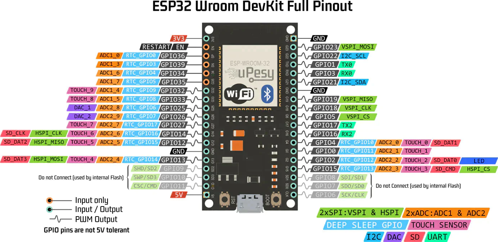

::: column
# ESP32 Diagram
.

# ESP32 Capacity

|                    |                          |
|--------------------|--------------------------|
| - WiFi 2.4Ghz      | - Analog GPIO            |
| - Bluetooth        | - Touch sensor           |
| - 240Mhz dual core | - Hall sensor            |
| - Digital GPIO     | - I2C, SPI, SD, UART,... |


# GPIOs digital specificities


| GPIO    | INPUT | OUTPUT | Comments           |
|---------|:-----:|:------:|--------------------|
| 0       |   Y   |   Y    | Pullup auto        |
| 1       |   N   |   Y    | TX0 UART PC        |
| 2       |   Y   |   Y    | Pulldown auto      |
| 3       |   Y   |   N    | RX0 UART PC        |
| 4 - 5   |   Y   |   Y    |                    |
| 6 - 11  |   N   |   N    | internal flash     |
| 12      |   Y   |   Y    | Pulldown auto      |
| 13 - 14 |   Y   |   Y    |                    |
| 15      |   Y   |   Y    | Pullup auto        |
| 16 - 33 |   Y   |   Y    |                    |
| 34 - 39 |   Y   |   N    | No pullup/pulldown |
| EN      |   N   |   N    | ESP32 Reset        |

:::

::: column
# Structure

```cpp
// Initialization function
void setup() {}

// Run function 
void loop() {}
```

# Digital IO

```cpp
pinMode(pin, [INPUT, OUTPUT, INPUT_PULLDOWN, INPUT_PULLUP]);
int digitalRead(pin);
digitalWrite(pin, value);
```

`value` can be `HIGH` or `LOW`

# Analog IO

```cpp
// return value between 0 - 4095
int analogRead(pin);

// fake analog => PWM; 0 - 255
analogWrite(pin, value);
```

# Advanced IO

```cpp
// generate square wave at freq
tone(pin, freq, duration_ms?);
// stop generating wave
noTone(pin);

// shift each bit of value to dataPin at clkPin speed
// if value = 22 (0010110) and bitOrder MSBFIRST then
// dataPin will take value 0, 0, 1, 0, 1, 1, 0 at rhythm
// of clkPin
shiftOut(dataPin, clkPin, [MSBFIRST, LSBFIRST], value);
```

# Time
```cpp
unsingned long millis(); // overflow: 50days
unsigned long micros(); // overflow 70min
delay(ms);
vTaskDelay(ms); // use if multi-threading
delayMicroseconds(us)
```


:::
::: column

# Serial

```cpp
void setup() {
  Serial.begin(baudrate); // usually 115200
}

void loop() {
  if (Serial.available() == 0) {
    String message = Serial.readString();
    // can be read byte by byte with Serial.read();
    message.trim();
  }
  Serial.print("Hello");
  Serial.println(" World");
  // Not mandatory, wait for transmission finish
  Serial.flush();
}
```

# External interrupts
```cpp
attachInterrupt(pin, function, [LOW, CHANGE, RISING, FALLING]);
detachInterrupt(pin);
noInterrupts(); // disable all interruptions
interrupts(); // re-enable all interruptions
```

# Mutli threading
/!\ do not overload core 0, this core control WiFi

```cpp
// core: 0 or 1
TaskHandle_t taskRef;
xTaskCreatePinnedToCore(taskFunc, threadName, stackSize, 
                        parameters, priority, &taskRef, core);
vTaskDelete(taskRef);

// example :
TaskHandle_t myThreadTask;
xTaskCreatePinnedToCore(myThread, "My thread", 10000, 
                        NULL, 2, &myThreadTask, 0);

void myThread(void* parameter) {
    doSomething();
    vTaskDelay(200);
    doSomethingElse();
    vTaskDelete(myThreadTask);
}
```
:::