:::::card

::::recto
:::head
__Comment utiliser ces cartes__
# Explication des cartes
> Des pistes de réflexion pour aborder le numérique responsable
:::


**Quelque soit votre profil, vous pouvez intégrer facilement les critères de l'éco-conception numérique dans vos projets.**
::::

::::verso
__Comment utiliser ces cartes__
# Explication des cartes

**Vous trouverez dans ces cartes des sujets de réflexion et d'implémentation qui vous permettront rapidement de minimiser les impacts matériels et de réduire les ressources générées par votre produit.**

Les cartes sont regroupées selon 5 thèmes : 
* **Comprendre le numérique responsable**
* **Rendre accessible à tous**
* **Améliorer les fonctionnalités**
* **Travailler les contenus**
* **Faire converger les pratiques**

**Public cible**

Tous les métiers liés de près ou de loin à la conception d’un service numérique : chef(fe) de projet, assistant(e) à maîtrise d’ouvrage (AMOA), assistant(e) à maitrise d’œuvre, product owner, UX researcher, designer, graphiste, développeur(se), devops, testeur(se), rédacteur ou rédactrice web, contributeur ou contributrice à un outil de gestion de contenu, etc.

::::

:::::

:::::card

::::recto
:::head
__Comprendre le numérique responsable__
# Le contexte global
> Un contexte d'utilisation de plus en plus intensif
:::

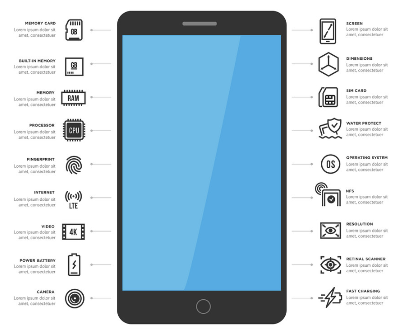

**Les impacts environnementaux du numérique augmentent chaque jour, il est important de penser optimisation dans la conception. Mais il est nécéssaire de réfléchir avant tout à l'usage et à trouver des astuces pour réduire les impacts d'un produit lorsque sa digitalisation est incontournable.**
::::

::::verso
__Comprendre le numérique responsable__
# Le contexte global


**Aujourd'hui, il est impossible d'ignorer que notre planète  atteint ses limites et que ces ressources ne sont pas infinies. En France, le secteur du numérique représente 2% des émissions de gaz à effet de serre et pourrait atteindre les 7% d'ici 2040. Nous avons donc un rôle à jouer pour imaginer des produits moins consommateurs de ressources, plus durables et plus accessibles.**


Le plus fort impact se porte sur le matériel, notamment sa fabrication. Il est donc nécessaire de prendre en compte cet aspect et favoriser la longévité des terminaux.

Aussi, lors de la phase de conception d'un produit, mener une réflexion suffisamment tôt aura u n impact fort sur le choix des fonctionnalités et va orienter la réflexion vers plus de sobriété.

Pendant l'implémentation, s'entourer des bonnes personnes et se concentrer sur les choix techniques vont permettre de  minimiser les impacts environnementaux.

**Imaginer et développer un produit sobre nécessite de faire des choix.**

::::

:::::

:::::card

::::recto
:::head
__Comprendre le numérique responsable__
# Les enjeux du Numérique Responsable
> Une multitude de raisons de concevoir des produits raisonnables par une équipe responsable
:::


**Vous ne savez pas comment faire accepter les critères de l'éco-conception numérique dans vos projets ? Les avantages sont multiples et le numérique n'a pas fini de créer de nouvelles opportunités aux impacts à mesurer.**
::::

::::verso
__Comprendre le numérique responsable__
# Les enjeux du Numérique Responsable

**Les enjeux du numérique responsable sont les mêmes que celui du développement durable. Ils visent à réduire leur empreinte économique, environnementale et sociale.**

Le numérique n'a pas fini d'évoluer et il faut garder à l'esprit qu'il peut améliorer les conditions humaines, environnementales et pas seulement économiques s'il est bien utilisé. Son impact est alors énorme et les enjeux à partager sont nombreux.
* Se démarquer de la concurrence
* Créer des parcours utilisateurs sobres
* Rendre les interfaces accessibles et intuitives
* Travailler la pertinence des fonctionnalités
* Prévenir les évolutions réglementaires
* Ne pas forcer les renouvellements d'équipement
* Permettre l'utilisation par le plus grand nombre
* Être performant dans tous les contextes
* Limiter le coût d'exploitation et de maintenance
* Penser un produit dans le temps
* Répondre aux attentes utilisateurs sur l'environnement
* Retenir les collaborateurs
* Respecter la vie privée des utilisateurs
* etc.

**Notre focus :** 

Proposer un **produit pérenne** qui offre de la valeur à chaque utilisateur et **anticipe les contraintes légales et environnementales** d'un futur proche.
::::

:::::

:::::card

::::recto
:::head
__Comprendre le numérique responsable__
# Analyse du Cycle de Vie
> Un outil d'analyse global
:::

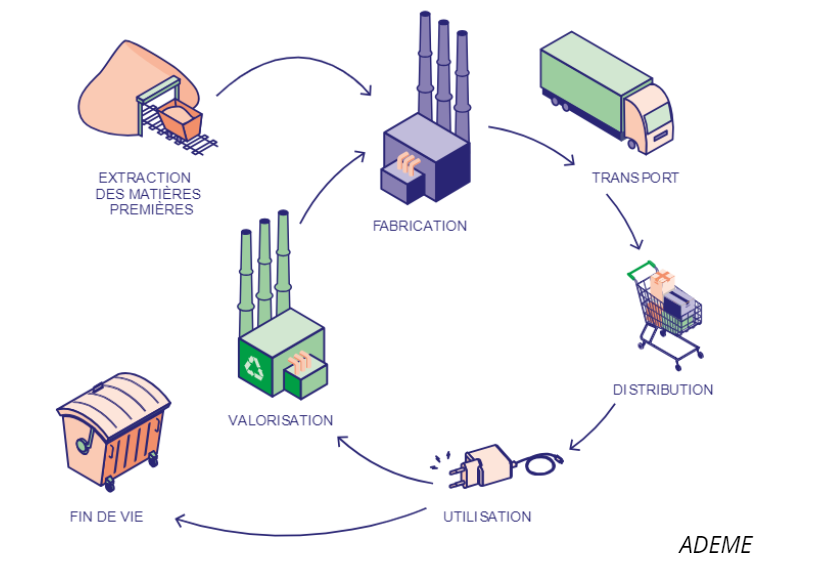

**L’analyse du cycle de vie (ACV) est l’outil le plus abouti pour l’évaluation globale et multi-critères des impacts environnementaux d'un objet ou d'un service.** 
**Cette méthode normalisée permet de mesurer les effets quantifiables sur l’environnement tout au long de la vie du produit. Elle est à la base de nombreux outils de comparaison.**

::::

::::verso
__Comprendre le numérique responsable__
# Analyse du Cycle de Vie

**Le cadre d'une ACV comprend l'ensemble des flux à prendre en compte dans une analyse dite du berceau à la tombe (« from cradle to cradle » en anglais) ce qui englobe l'extraction des matières premières (énergétiques ou non) nécessaires à la fabrication et à l’assemblage, la distribution, l'utilisation, la collecte et l'élimination ainsi que toutes les phases de transport.**

L'analyse porte sur les flux entrants, c'est-à-dire tout ce qui entre dans la fabrication du produit, et sortants, ce qui sort en matière de pollution :
* parmi les flux entrants, se trouvent entre autres les matières et l’énergie : ressources en minerais, eau, pétrole, gaz ;
* les flux sortants peuvent correspondre aux déchets, émissions gazeuses, liquides rejetés, etc. 


Une ACV est réalisée sur le périmètre d'une Unité Fonctionnelle (voire carte correspondante). Elle permet de fournir notamment un **diagnostic** c'est à dire une vision non biaisée des impacts et à pour objectif l'**amélioration de la conception** grâce à une stratégie de réduction d'impacts.


La réalisation d’une ACV sur un produit physique, dont l’ensemble de la phase de production est maîtrisée, est un exercice compliqué. Dans le cas d’un logiciel, la tâche est particulièrement complexe parce qu'il n'a pas d'existence physique. Nous nous basons donc sur des extrapolations de données pour connaître le matériel qui permet de faire fonctionner le service numérique, des ACV simplifiées. **Cela permet tout de même d'avoir une idée de l'impact environnemental et de voir si les améliorations de conception permettent de diminuer celui-ci.**

::::

:::::


:::::card

::::recto
:::head
__Comprendre le numérique responsable__
# Unité fonctionnelle
> Exprimer les impacts sur un élément représentatif pendant une durée de vie prédéterminée

:::
							  
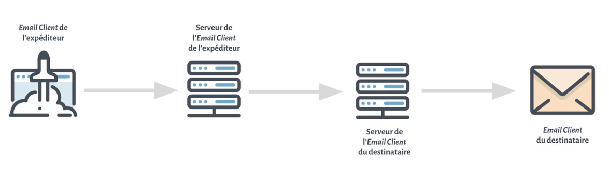

**Les mesures d’impacts, tel que les Analyses du Cycle de Vie (voire Carte), se font sur une Unité Fonctionnelle. C'est une unité de mesure qui permet d’effectuer les comparaisons finales. Concrètement, elle décrit le service rendu en se concentrant sur les fonctions principales du produit, pour permettre notamment la comparaison entre différentes solutions techniques.**

::::

::::verso
__Comprendre le numérique responsable__
# Unité fonctionnelle

Comment déterminer une unité fonctionnelle ?
Une unité fonctionnelle (UF) serait comparable à une User Story ou Feature d’un produit, c’est-à-dire la réponse à un besoin. Il est important de se concentrer sur le service rendu et de sortir du moyen de réalisation. Ce qui fait qu'une unité fonctionnelle est formulée autour de questions simples : 
* **Quoi ?** Un verbe qui représente la fonction assurée ou le service rendu. 
* **Combien / Comment ?** Un critère qui quantifie/qualifie la fonction ou le service. 
* **Combien de… ?** Une durée/fréquence de fonctionnement s'il ne s’agit pas d’un acte unitaire. 

Prenons un exemple simple d’unité fonctionnelle : 
* **Se déplacer d’un point A à un point B distant de 5 km**
* **Envoyer un email**

Une fois l’unité fonctionnelle définie, il est possible d’**identifier des scénarios qui correspondent à des façons différentes de la réaliser**. Dans le cas de l’envoi d’un email, on peut faire varier le nombre de destinataires, la taille du mail, le pourcentage de lecture, etc. 
Ces différents scénarios peuvent mettre en évidence des choix d’implémentations ou d’outils différents. Ils peuvent également permettre un comparatif entre deux fonctionnements existants dans une entreprise et lui permettre ainsi de changer ses processus internes pour en diminuer l’impact environnemental.


::::

:::::

:::::card

::::recto
:::head
__Comprendre le numérique responsable__
# Et l'impact technique ?
> Faire converger l'équipe de réalisation vers une pratique commune
:::


**Cette fiche se concentre sur la partie conception fonctionnelle mais il faut veiller à échanger régulièrement avec l'équipe de réalisation qui va développer le produit selon ses challenges d'écoconception dont voici certains exemples.**

::::

::::verso
__Comprendre le numérique responsable__
# Et l'impact technique ?

**L'écoconception technique permet une convergence autour des pratiques de sécurité, de référencement SEO, d'accessibilité ou encore de performance. Ci-dessous une liste non exhaustive des sujets abordés par les membres techniques de l'équipe.**

**Développement**
* Rester compatible avec les matériels et logiciels les plus contraignants (ex : rétrocompatibilité, équipements spécifique comme l'IoT ou l'embarqué, réseaux à faible débit).
* Construire des sites et applications légers et rapides.
* Choisir une d’architecture (JAMStack, SPA, asynchrone,…) et connaître ses limites (exemple micro services : appels serveur fréquents, consommation CPU importante, overhead des conteneurs).
* Limiter les échanges réseaux (client/serveurs).
* Connaître la puissance de calcul nécessaire pour limiter l'usure des équipements.
* Choisir des outils performants et les garder à jour.
* Consommer moins de ressources serveur et réseau pour ne pas avoir besoin de déployer de nouvelles infrastructures.

**Hébergement**
* Laisser la place aux autres services sur des infrastructures mutualisées.
* Faire attention à l'effet rebond (dimensionnement dynamique, fermer les VM quand elles ne sont pas utilisées).
* Mettre en place des outils de monitoring (CPU consommé, échanges réseau, etc.).


::::

:::::

:::::card

::::recto
:::head
__Faire converger les pratiques__
# Responsabilité Sociétale des Entreprises
> Faire le lien avec la politique RSE de l'entreprise
:::

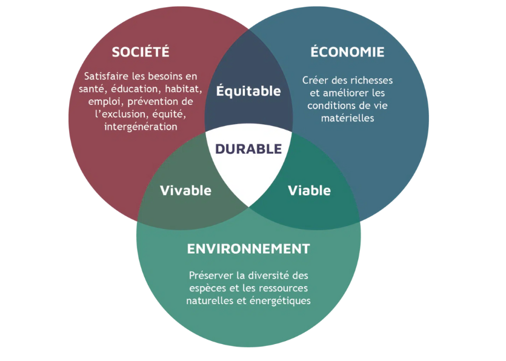

**La politique RSE permet d'identifier les axes sur lesquels s'aligner pour faciliter la mise en place de pratiques responsables, d'identifier des appuis internes et de mettre en avant les démarches réalisées voire de les partager.**

::::

::::verso
__Faire converger les pratiques__
# Responsabilité Sociétale des Entreprises

**La RSE regroupe l’ensemble des pratiques mises en place par les entreprises dans le but de respecter les enjeux et objectifs du développement durable : Social, Environnemental et Économique.**

Dans le cadre du développement d'un produit en adéquation avec les principes du numérique responsable (NR) les éléments qui sont les plus évidents à suivre et améliorer concernent l'environnement, la protection de l'utilisateur et les bonnes pratiques des affaires. 

Il est important de connaître les objectifs de la politique RSE pour mettre en place des actions en lien avec celle-ci, et ainsi ancrer la démarche NR dans un contexte global, ce qui facilitera l'ensemble des décisions prises au sein du projet, pour le produit, pour les utilisateurs, etc. 
Il se peut également que certains indicateurs soient à intégrer pour mettre en avant le produit vis-à- vis de la gouvernance. 

:::img medium
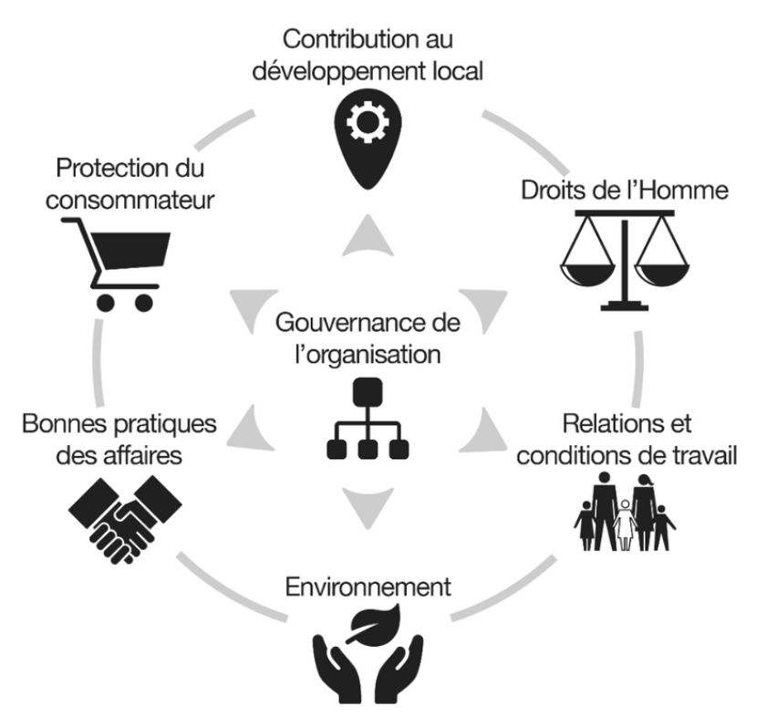
:::

::::

:::::

:::::card

::::recto
:::head
__Faire converger les pratiques__
# Sécurité et gestion des données
> Faire converger les pratiques pour consolider le service
:::


**Réduire l'impact environnemental d'un service, c'est notamment éviter le renouvellement du matériel, mais cela peut atteindre la sécurité des équipements dûe à l'arrêt de la maintenance des OS.**
::::

::::verso
__Faire converger les pratiques__
# Sécurité et gestion des données

**Pour limiter ces divergences, il est nécessaire d'intégrer des pratiques communes dès la conception. Il s'agit d'être dans l'anticipation : la cybersécurité est l'anticipation des menaces ; l'écoconception est l'anticipation des impacts sociétaux et environnementaux ; la gestion des données est l'anticipation du volume et de l'obsolescence des informations.**

**Penser minimisation.** 

Du point de vue de la protection des données, cela équivaut au principe de **moindre-donnée**. Ce principe ce retrouve en écoconception où les fonctionnalités sont ajustées aux besoin, les données collectées étant donc réduite au strict nécessaire via des formulaire adapté. Ce principe converge avec les demandes liées à la RGPD en matière de nécessité de collecte des données (voir la fiche correspondante). Ainsi, on utilisera moins de stockage, on réduira les transfert de donnée, etc.

Au niveau de la cybersécurité, c'est le principe du **moindre-privilège**, c’est-à-dire la limitation des droits au strict minimum sur les postes clients, du nombre de logiciels installés, ce qui, en plus de diminuer la surface d’attaque, est susceptible de réduire les impacts liés à l’usage du poste de travail ainsi que l’obsolescence matérielle prématurée due aux logiciels installés ou encore à un espace disque saturé dû à ces mêmes logiciels.

Pour l'écoconception, c'est la **moindre fonctionnalité** (voire carte Kano).

::::

:::::

:::::card

::::recto
:::head
__Faire converger les pratiques__
# L'accessibilité des données avec FAIR
> Construire, stocker, présenter ou publier des données
:::

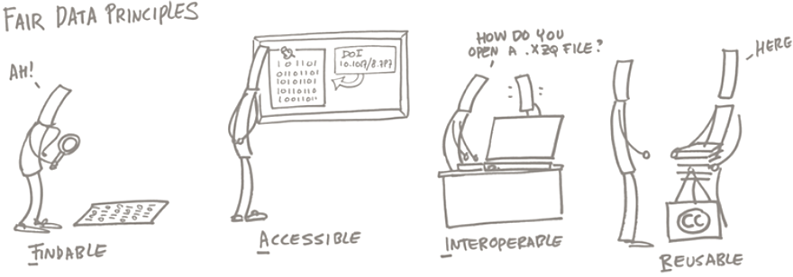

**Le premier coût environnemental de la donnée est lié à son acquisition. Cette acquisition ou cette création de donnée a donc dès l’origine un coût environnemental important pour lequel une attention doit être portée notamment sur la conservation. Pour cela l'application des principes FAIR (data Findable, Accessible, Interopeable, Reusable) permet de mettre en place les bases d’une bonne gestion des données.**
::::

::::verso
__Faire converger les pratiques__
# L'accessibilité des données avec FAIR

Dès l’instant où on aura validé que la donnée produite ou acquise mérite d’être conservée (la **première bonne démarche environnementale étant celle de ne pas produire ni conserver de données inutiles**), il va falloir tout au long de son cycle de vie se poser les bonnes questions pour minimiser les impacts environnementaux voire sociétaux

**Comment agir pour les données ?**
* **Ne pas produire** de donnée inutiles (sobriété).
* Appliquer à chacune des étapes de son cycle de vie des principes FAIR :
  * En phase d’usage, **minimiser la distance** à parcourir sur les réseaux entre l’usage de la donnée et son stockage.
  * Utiliser les **ressources de stockage/archivage/sauvegarde les plus éco-responsables** possibles et adaptées aux volumes concernés.
  * Appliquer les **principes FAIR** (formats standards ouverts et interopérables, données accessibles aux autres, données identifiées avec des métadonnées utilisables et normalisées).
* Utiliser les **réseaux de transports les moins polluants**. Les voici par ordre d'impact croissant : le filaire, le wifi et les réseaux mobiles (3G/4G/5G...).
* Se former et s’informer autour des **bonnes pratiques de la gestion des données** et intégrer les principes de sobriété sur les ressources utilisées pour manipuler, exploiter et stocker ces données en fonction du domaine d’utilisation.
* Limiter les redondances, se montrer **critique sur les données à conserver**, connaître et appliquer les bons principes de sauvegarde et d’archivage sur les données froides et chaudes.

::::

:::::

:::::card

::::recto
:::head
__Faire converger les pratiques__
# RGPD et droit à l'oubli
> Rendre la gestion des données à leurs propriétaires
:::


**De plus en plus de données sont collectées à travers les services numériques, que l'on s'en rende compte ou non.** 
**Lorsque l'on réalise des services responsables, il est nécessaire de limiter les nouvelles traces que l'utilisateur laisse en utilisant le produit pour garantir sa vie privée.** 

::::

::::verso
__Faire converger les pratiques__
# RGPD et droit à l'oubli

**Depuis 2018, le règlement général de protection des données (RGPD) renforce les droits des personnes et introduit une plus grande responsabilité des entreprises sur les conditions de recueil des données personnelles, une vraie convergence avec le numérique responsable. D'ailleurs un des principes est le droit à l'oubli qui prévoit que les données personnelles doivent être sauvegardées pour un temps limité en rapport avec leur finalité.**

Il y a quelques actions et questionnements simples à adresser pour limiter les mauvaises pratiques :
* A chaque fois que l'on crée de la donnée, il faut être sûr que celle-ci est nécessaire : qui l'utilisera ? dans quel but ? à quelle fréquence ? 
* Pour les données jugées nécessaires, que fait-on lorsque leur usage est terminée (notamment si c'est pour des utilisateurs d'analyse marketing, une fois les analyses faites, la RGPD dit qu'il faudrait la supprimer).
* Dans l'ensemble il faut anonymiser les données en dehors du services et limiter (voire refuser) leur commercialisation. 
* Pour gagner la confiance des utilisateurs, il est également possible de bien détailler l'ensemble des informations conservées et expliquer le besoin derrière.

Sur le droit à l'oubli des données, les démarches doivent être simples, voir automatiques pour limiter les demandes par exemple tous les comptes non accédés ou les données non utilisées depuis x mois sont supprimés, un bouton depuis le compte utilisateur permet de supprimer son compte ou ses données, etc.

S'aider du jeu RGPD de la CNIL : https://design.cnil.fr/resources

::::

:::::

:::::card

::::recto
:::head
__Faire converger les pratiques__
# Dark patterns, l'impact humain
> Ne pas manipuler l'utilisateur
:::

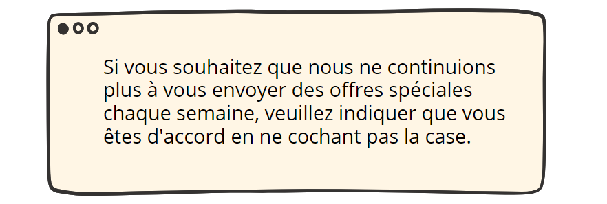

**Il s’agit des pratiques de conception dont l’objectif est de piéger l’utilisateur en s’appuyant sur les biais cognitifs. Les méthodes ne sont pas toujours mises en place de façon maligne, mais il peut être plus simple de les utiliser pour arriver aux objectifs attendus par l’éditeur du service.**
**Il convient dans la conception d’un service responsable de les éviter consciemment pour limiter un impact négatif sur l'utilisateur et réduire l'impact éthique du produit.**

::::

::::verso
__Faire converger les pratiques__
# Dark patterns, l'impact humain

**Ces designs sont conçus pour tromper les utilisateurs et les induire en erreur, ce qui les conduit à être confus, se sentir trahis et frustrés. En tant que PO, il est donc essentiel d'éviter ces modèles de conception et de proposer un parcours utilisateur attrayant.**

D’un point de vue plus humain, cela peut pousser l’utilisateur à arrêter d’utiliser un service pour aller éventuellement vers une autre option plus sobre, efficace, fluide, etc.

Voici quelques recommandations de conception qui doivent être prises au sérieux pour aider à éviter les modèles sombres :
* Introduisez des **normes strictes de pratiques de conception** pour les concepteurs.
* Insuffler de l'empathie dans la conception et **favoriser l'intérêt de l'utilisateur.**
* **Privilégier l'expérience utilisateur** et ne pas se focaliser sur le nombre de visiteurs et d'abonnements.
* S'inspirer des conceptions UX qui suivent un processus de conception éthique comme le **guide des designers éthiques.**
* Menez des recherches approfondies sur les utilisateurs pour **connaître leurs attentes.**


::::

:::::

:::::card

::::recto
:::head
__Faire converger les pratiques__
# Dark patterns, l'impact Environnemental
> Limiter la création et l'échange d'informations
:::

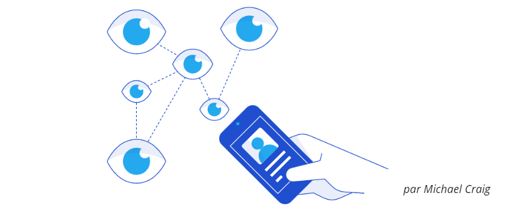

**De façon générale ces mauvaises pratiques entraînent :**
* **la génération excessive de données lorsque les utilisateurs acceptent les cookies et leur stockage,**
* **un échange important d’informations sur le réseau quand ils naviguent sur des pages et des pages pour réaliser un parcours,**
* **l’augmentation de besoins de stockage notamment lors de la génération de campagnes d’e-mailing.**


::::

::::verso
__Faire converger les pratiques__
# Dark patterns, l'impact Environnemental

**Dans le cas du pattern nommé “Roach Motel” (dénomination d’un attrape insecte dont il est très difficile de sortir), l’utilisateur est amené à faire de nombreuses actions pour arriver à son objectif, ici se désabonner.**

:::img large
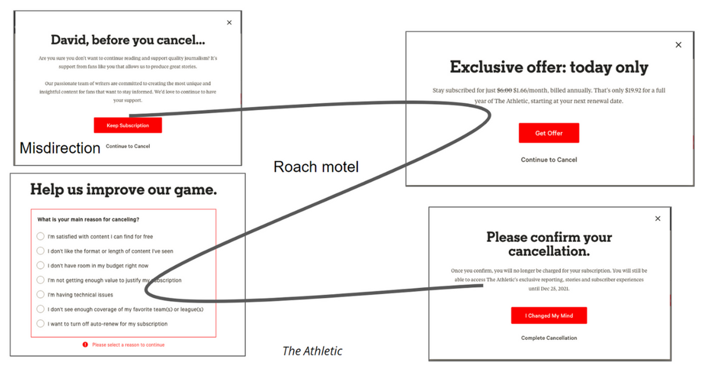
:::

Ces actions entraînent donc de nombreux échanges de données pour charger les différentes pages impactant la **consommation d’énergie** de l’ensemble des équipements du service numériques (téléphone/ordinateur, réseaux, serveurs). 
Les actions étant souvent surveillées par des cookies, des **données du parcours sont créées**. Et dans certains cas, l’étape d’arrivée peut même être la réalisation d’une action en dehors du service numérique, comme l’envoi d’un recommandé (avec son impact environnemental dédié). 

::::

:::::

:::::card

::::recto
:::head
__Faire converger les pratiques__
# Créer son canvas
> S'approprier une stratégie responsable
:::

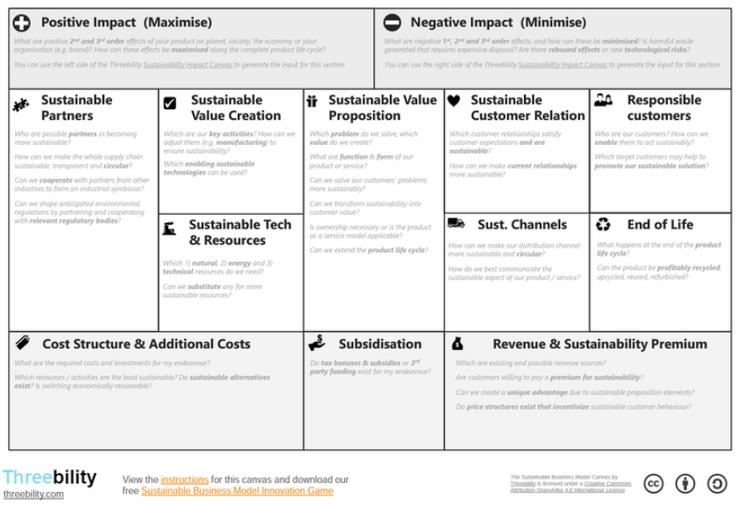

**Les sujets d'impacts environnementaux et sociétaux sont souvent mis de côté lors d'atelier Product Canvas. Leur introduction dès cette étape permet de simplifier leur intégration dans le cycle de vie complet du produit.**
::::

::::verso
__Faire converger les pratiques__
# Créer son canvas

**Pour ne pas oublier les sujets portés par le numérique responsable, il est utile de les intégrer dans le canvas choisi. Il n'y a pas une solution, ou un canvas par défaut, plutôt des questions et thématiques à intégrer.**

Pour ce faire, il est nécessaire d'identifier les notions responsables qui sont les plus importantes pour le produit et de faire évoluer le canvas  en créant des nouveaux segments ou bien de nouvelles questions dans les segments existants. Par exemple :
* **section risque** : intégrer des notions d'impact et de vulnérabilité liées aux dérèglements climatiques (difficulté d'approvisionnement, hausse des tarifs ou raréfaction de l'énergie, etc.).
* **section impact** : consulter les lois environnementales et sociales existantes ou en cours de rédaction avec impact sur le produit/service.
* **section solutions** : adresser les options lowtech voire non numériques.
* **section des parties prenantes** : réfléchir aux sujets d'accessibilité (handicap et accès au numérique).
* **section utilisateur** : questionner une possible addiction.
* **section solution** : identifier si le produit répond à des objectifs de développement durables de l'ONU.
* **section KPI** : voir carte métriques.

Exemples de canvas responsables : 
* Digital Product Ethics et Sustainable Business Model de Threebility
* Sustainable Business Model de Case
* Circular design de Alain Daou

::::

:::::

:::::card

::::recto
:::head
__Améliorer les fonctionnalités__
# Modèle de Kano
> Mesurer la pertinence d'une fonctionnalité dans le cadre d’un développement responsable
:::

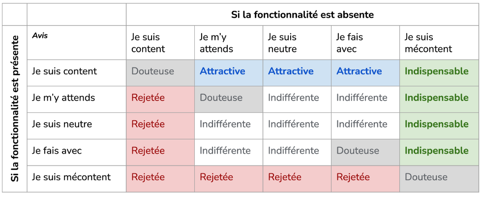

**Avec le modèle de Kano, le focus est double :** 
* **Identifier les fonctionnalités à ne pas développer.**
* **Mettre en avant et faciliter l’utilisation des fonctionnalités attractives et indispensables.**

::::

::::verso
__Améliorer les fonctionnalités__
# Modèle de Kano

Il s’agit d’un **questionnaire standardisé** qui permet de mesurer l’opinion des utilisateurs pour chaque fonctionnalité. Les participants doivent répondre à deux questions pour chaque caractéristique du produit, dont l'une est « fonctionnelle » (formulée de manière positive) et l'autre « dysfonctionnelle » (formulée de manière négative). 

Les questions sont semblables aux suivantes : 

**Fonctionnelle :**
  Que pensez-vous de la présence de la fonctionnalité A ?

**Dysfonctionnelle :**
  Que penseriez-vous s’il n’y avait pas la fonctionnalité A ?

Une matrice de corrélation entre les réponses fonctionnelles et dysfonctionnelles pour chaque élément permet de les classer en 5 catégories : **attractive, indispensable, indifférente et rejetée** ; auxquelles est souvent ajoutée la catégorie **douteuse** c’est-à-dire dont les attentes utilisateurs sont fortement contradictoires. 

Ce modèle est plus facile d’utilisation pour un service déjà existant et nécessitant une évolution ou une refonte. 
Cependant il peut être appliqué à tout service numérique.

::::

:::::

:::::card

::::recto
:::head
__Améliorer les fonctionnalités__
# L'impact mapping responsable
> Intégrer une stratégie responsable au plus tôt
:::

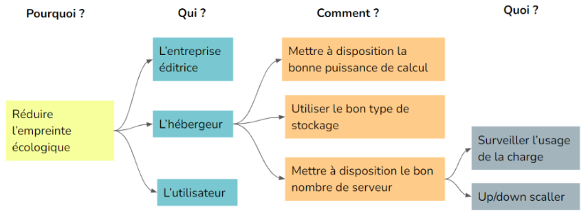

**Les entreprises ont de plus en plus d'objectifs de réduction de leur impact environnemental (notamment avec leur politique RSE), mais il n'est pas simple de les décliner au niveau projet.**
**L'impact mapping permet de définir dès le début du projet l'objectif responsable du produit et de confronter les fonctionnalités à cet objectif dès leur émergence.**

::::

::::verso
__Améliorer les fonctionnalités__
# L'impact mapping responsable

**L’impact mapping, créé par Gojko Adzic, est une méthode de planification stratégique sous forme de mindmap permettant de décider des fonctionnalités à intégrer dans un produit.**

* Identification de l'objectif visé.
* Positionnement des fonctionnalités identifiées par leur impact direct sur la réalisation de cet objectif.

L’impact Mapping peut être utilisé dans un contexte d’écoconception de deux façons :
* lors de la phase d'idéation ou de définition du besoin, avec pour objectif que **le produit ait une empreinte écologique réduite**, puis en essayant pour chaque fonctionnalité de définir : 
  * pour qui, comment et avec quoi cette fonctionnalité va pouvoir permettre d’atteindre l’objectif durable ?
* lors d’un travail de détail d’une fonctionnalité, en ajoutant pour chaque **acteur / utilisateur un impact responsable à chaque fois :**
  * comment l’utilisation de cette fonctionnalité par l’utilisateur réduit son empreinte écologique ? 
  * comment l’utilisation de cette fonctionnalité par l’utilisateur réduit l’empreinte écologique du service numérique ?

A travers ces questions, différentes solutions sont identifiées, certaines arriveront jusqu'au stade de user stories et seront priorisées dans le backlog. D'autres peuvent un impact plus grand au niveau du services voire des politiques de développement globales.

::::

:::::

:::::card

::::recto
:::head
__Améliorer les fonctionnalités__
# Questions C.O.E.U.R.
> Se concentrer sur un aspect précis de simplification de l’interface
:::


Ce n'est pas tâche facile de créer une interface simple, il n'est pas rare de créer de la complexité s'en rendre compte. Les questions C.O.E.U.R. vont aider l'équipe à réduire la complexité de certains éléments. 
::::

::::verso
__Améliorer les fonctionnalités__
# Questions C.O.E.U.R.

**La méthode C.O.E.U.R. imaginée et réalisée par Rémi Guyot, se présente sous la forme d’un jeu de cartes. Elle a pour objectif de diminuer la complexité.**

Cet atelier d'idéation va mener l'équipe à repenser une interface trop complexe ou chargée, en travaillant individuellement ou par groupe sur un aspect précis de simplification de l’interface : 

* **C pour Cacher :** 
  * Mettre hors de vue un élément d’interface non indispensable.

* **O pour Ordonner :** 
  * Apporter de la hiérarchie et de la structure à l’interface en organisant différemment certains composants.

* **E pour Éliminer :** 
  * Supprimer tout bonnement un composant de l’écran.

* **U pour Uniformiser :** 
  * Standardiser, harmoniser des éléments entre eux.

* **R pour Réduire :** 
  * Diminuer l’importance d’un élément de l’interface.

Les interfaces les plus simples sont aussi souvent les plus complexes à réaliser. Combattre la complexité est plus facile en se concentrant sur des tâches uniques.

Cette méthode peut être utilisée pour simplifier les contenus ainsi que les fonctionnalités.

::::

:::::

:::::card

::::recto
:::head
__Améliorer les fonctionnalités__
# Green IT Analysis
> Quantifier les impacts environnementaux
:::

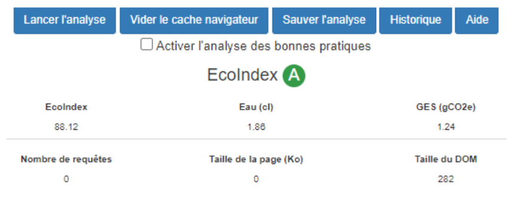

**L’extension Green IT Analysis permet en quelques clics d'avoir une idée de l'empreinte environnementale d'une page web et fournit une liste de bonnes pratiques à appliquer.** 
**La note EcoIndex peut être un premier indicateur simple à mettre en place pour suivre les améliorations du produit ou de réaliser un comparatif.** 

::::

::::verso
__Améliorer les fonctionnalités__
# Green IT Analysis

**GreenIT-Analysis est une extension pour navigateur qui vous permet de quantifier les impacts environnementaux d'un parcours utilisateur complet, en se basant sur des ACV. Cela permet de voir l'évolution rapidement d'amélioration visant l'écoconception.**

L’analyse se base sur une ACV réalisée pour une application web et comprend deux critères : les émissions de **gaz à effets de serres** en grammes équivalent CO2 et la **consommation d’eau** en centilitres. 

Une note entre A et G est fournie, permettant de rapidement comprendre la performance environnementale de la page. Cette note est calculée à partir de trois critères : 
* la **complexité de la page**, représentée par son nombre de composants (nombre d'éléments du DOM), 
* le **poids de la page** 
* le **nombre de requêtes**. 

L’application teste un sous-ensemble des 115 bonnes pratiques d’écoconception web et fournit un rapport, ce qui permet d’**identifier rapidement des pistes d’améliorations**. 

Toute l’analyse se fait en local, un historique permet de sauvegarder les notes et impacts page par page pour analyser un parcours client.

Vous pouvez quantifier les impacts environnementaux d'un parcours utilisateur en lançant et en enregistrant des analyses successives après chaque page visitée. 

::::

:::::

:::::card

::::recto
:::head
__Améliorer les fonctionnalités__
# Définir des métriques 
> Suivre l'impacts des actions réalisées
:::
```intro```


**Les ultimes métriques de l'impact environnemental sont celles d'un ACV, mais le processus est long, complexe. Alors comment faire ? Et que prendre en compte pour la partie sociale ?**
**Définir des indicateurs permet de voir si les actions vont dans le bon sens dans la limitation de l'impact environnemental et dans l'amélioration de l'impact social.**
::::

::::verso
__Améliorer les fonctionnalités__
# Définir des métriques 

**Hormis la quantité de CO2eq produit par unité fonctionnelle qui commence à prendre sa place dans les indicateurs responsables d'un service numérique, il n'y a pas d'indicateur partagé par tous. Effectivement, chaque service est différent, ainsi chaque équipe a des objectifs d'amélioration variables.**

L'objectif est de superviser la mise en place de pratiques identifiées (comme celles partagées dans ces cartes). 

Voici quelques pistes d'indicateurs "faciles" à suivre : 
* la **rétrocompatibilité** en identifiant les plus anciens OS, navigateurs ou appareils supportés.
* les analytiques notamment le **temps d'utilisation** par unité fonctionnelle principale.
* la **performance** dans différents contextes d'utilisation (matériel, type de réseaux, etc.) avec les core vitals ou le speed index.
* la **satisfaction utilisateur** grâce à des enquêtes, des tests ou grâce à la méthode Kano.
* les données et l'**évolution de leur volume**, accès, utilisation.
* la facture de l'hébergement du service.
* **conformité de l'accessibilité** par rapport à RGAA.

Il existe des indicateurs plus techniques comme le nombre de composants, de CPU consommé, d'échanges réseau, le temps de réponse d'API, etc.

Il est important de se limiter à un certain nombre d'indicateurs sinon ils deviennent trop complexes à exploiter et tombent souvent dans l'oubli.

::::

:::::

:::::card

::::recto
:::head
__Améliorer les fonctionnalités__
# Créer un score responsable
> Se positionner dans un projet durable
:::

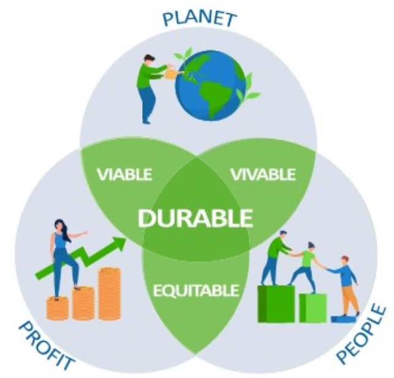

**Le numérique responsable est une solution à la réalisation d'un développement (plus) durable, c'est-à-dire avec un équilibre des axes personnes/planète/prospérité. Il est donc nécessaire de savoir identifier si le produit agit vers cet équilibre ou fait pencher la balance d'un côté ou d'un autre.**

::::

::::verso
__Améliorer les fonctionnalités__
# Créer un score responsable

**Le score responsable est un outil de posture du produit par rapport aux objectifs du développement durable, il complète les métriques "classiques" en identifiant l'empreinte du produit sur les 3 piliers du développement durable.**

Spécifique ou inspiré de scores existants (comme ci-dessous), le score est en lien avec les objectifs ou challenges responsables identifiés lors d'un Product canvas (voire carte correspondante), qui peuvent donner les grands axes de notation. Pour chacun de ces axes, le but est d'identifier le niveau de réalisation actuel et ainsi de définir les actions à mettre en place pour respecter les attentes responsables identifiées pour le produit. 

Ici, l'exemple du "Score d'empreintes du produit", notation responsable pour évaluer un produit issu du livre blanc de Fabrice des Mazery intitulé **Responsables, réduire l'empreinte de nos produits numériques sur les individus, l'environnement et l'économie.**
:::img medium
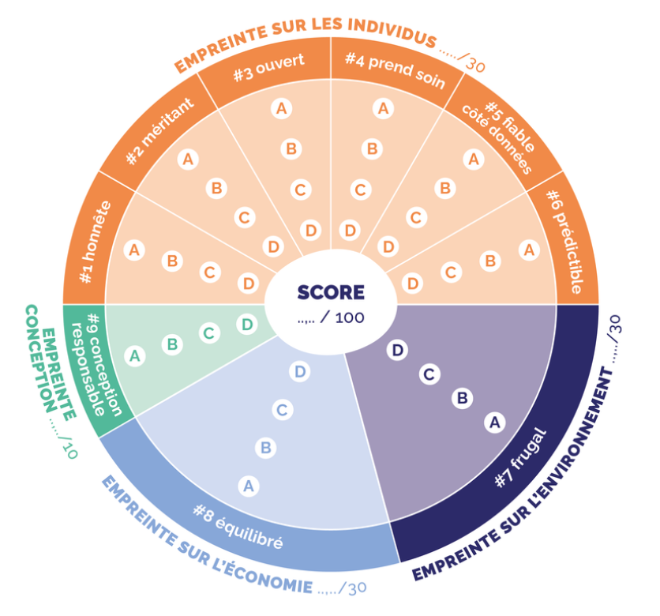
:::
::::

:::::

:::::card

::::recto
:::head
__Améliorer les fonctionnalités__
# Limiter le nombre d'interactions
> Fluidifier une interface et permettre à un utilisateur d’atteindre plus rapidement son objectif
:::

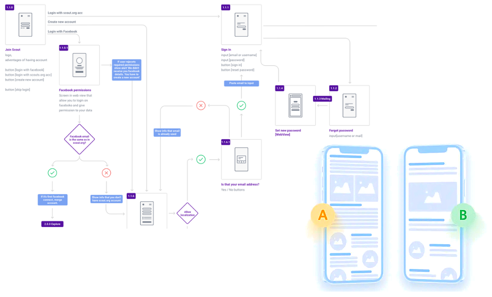

**Suivre le nombre d'actions pour chaque scénario conçu avec une unité fonctionnelle et évaluer les impacts et métriques de chacun afin de proposer une expérience fluide et sobre.**
::::

::::verso
__Améliorer les fonctionnalités__
# Limiter le nombre d'interactions

**Les scénarios sont matérialisés selon les éléments à analyser. Cela peut être un prototype pour évaluer un parcours utilisateur ou un élément précis développé pour avoir un contexte réel.**

Vous avez déterminé vos scénarios d'utilisation avec l'Unité fonctionnelle (voir carte correspondante) ou avec le User Flow. Votre objectif est alors d'évaluer l'expérience utilisateur afin de la rendre fluide et **réduite en impacts** générés par ce parcours.

Pour cela, l'équipe de conception aura définit **des critères pour effectuer des tests** afin de choisir le scénario le moins impactant.

**Des exemples de critères pour effectuer les tests :**
* nombre d'écrans nécessaires à l’utilisateur pour exécuter une tâche ;
* nombre de clics ;
* nombre de champs ;
* temps de chargement d'une page ;
* temps nécessaire à l’utilisateur pour finaliser une tâche ;
* pourcentage de tâches correctement exécutées par les utilisateurs ;
* combien d’erreurs ont été commises par l’utilisateur ;
* nombre de requêtes...

Suivre ces données permet aussi d'améliorer continuellement le produit ou service sur lequel il faut se concentrer.

::::

:::::

:::::card

::::recto
:::head
__Rendre accessible à tous__
# Personae
> Se concentrer sur les besoins utilisateurs
:::


**Les fiches personae permettent à l’équipe de conception de rester centrée sur les utilisateurs finaux, de déterminer ce que le produit ou service doit faire et quels bénéfices ils vont apporter.**

::::

::::verso
__Rendre accessible à tous__
# Personae

Un persona est un archétype représentant un groupe de personnes dont les comportements, motivations et buts sont proches. C'est un **livrable de la recherche utilisateur** qui condense les informations qui seront utiles à l'équipe de conception.

Il y a une information indispensable à avoir, c'est **connaître la configuration matérielle**, et l’inclure dans la **stratégie de test**. En effet, un des piliers de l'éco-conception est la réduction d'impact via le matériel, l'utilisateur devant garder son matériel le plus longtemps possible et consommer le moins de ressources possible.

**Les informations importantes :** 
* le(s) type(s) d’appareil(s).
* le type de connexion (quelle utilisabilité avec des connexions bas débit ?).
* le type de forfait.
* le nombre d’heure d’utilisation.

Les scénarios d’utilisation, les modalités d’interaction, l’architecture d’information doivent être pensés pour permettre aux personae d’atteindre leurs buts dans les meilleures conditions. L'équipe de conception sera amenée à arbitrer sur les choix à faire pour construire un produit adapté aux besoins des utilisateurs tout en allant vers plus de sobriété.

::::

:::::

:::::card

::::recto
:::head
__Rendre accessible à tous__
# Accessibilité, les tests de bases
> Permettre à tout le monde, sans discrimination, d’avoir accès aux services numériques
:::


**Le numérique responsable a pour objectif d’améliorer l'empreinte écologique et sociale des technologies numériques. L’accessibilité numérique permet à tout le monde, sans discrimination, d’avoir accès aux services numériques, indépendamment de la situation de l’utilisateur.**

::::

::::verso
__Rendre accessible à tous__
# Accessibilité, les tests de bases

**D’après l’enquête “Handicap, incapacités, dépendance de l’INSEE” (HID 1999), 13 millions de personnes sont concernées par le handicap en France. Ce chiffre atteint 20 millions de personnes si l’on prend en compte les seniors qui sont peu habitués à utiliser les outils numériques.**

**Les sites web**

Desktop :
* Navigation clavier.
* Zoom 200%.

Mobile :
* L’affichage s’adapte, quelle que soit l’orientation de l’appareil.
* L’application prend en compte les préférences système d’affichage (ex : taille de la police ou des boutons).

**Les applications mobiles natives**
* Est-ce que l'application peut-être utilisée quelque soit l'orientation de l'appareil ?
* Est-ce que les préférences de l'utilisateur réglées au niveau du système sont prises en compte (mode sombre, taille du texte, animation réduite, etc) ?
* Est-ce que les éléments interactifs sont assez gros pour qu'on puisse les toucher sans activer autre chose par accident ?

::::

:::::

:::::card

::::recto
:::head
__Rendre accessible à tous__
# Accessibilité, aller plus loin avec les référentiels
> Permettre à tout le monde, sans disrimination, d’avoir accès aux services numériques

:::

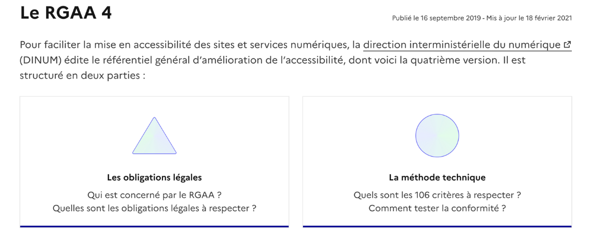

**Il existe plusieurs normes d’accessibilité à vérifier en amont pour contrôler la conformité d’un service numérique et ainsi permettre à tous les utilisateurs d’accéder équitablement au service. En France, les organismes publics et certaines entreprises privées ont une obligation légal de mise en conformité avec le RGAA et doivent publier une déclaration d'accessibilité sous peine de sanctions.**

::::

::::verso
__Rendre accessible à tous__
# Accessibilité, aller plus loin avec les référentiels

**Pour s'assurer de la conformité d’un service numérique, les concepteurs disposent de plusieurs outils pour intégrer les bonnes pratiques lors de la phase de conception puis de développement.**

**Pourquoi le faire ?**
* Améliorer le **référencement naturel**. Un site accessible aux personnes en situation de handicap, est également mieux positionné dans les résultats des moteurs de recherche.
* Lutter contre les **discriminations** et multiplier ses **utilisateurs**. 
* Assurer une meilleure **expérience utilisateur** (UX) pour tous.

**Référentiels et guides essentiels** 
* Le Référentiel Général d'Amélioration de l'Accessibilité (RGAA) propose un cadre opérationnel de vérification de la conformité aux exigences légales d'accessibilité via **106 critères de contrôle** accompagné de tests et méthodes techniques.
* Les **Guides Apple** (https://developer.apple.com/accessibility) et **Android** (https://support.google.com/accessibility/android) définissent les bonnes pratiques à suivre et les outils concret à utiliser pour créer des applications mobiles natives accessibles.

Même si ces éléments sont principalement à destination de l’équipe de réalisation, il est **important d’intégrer les contraintes de design et techniques** dans les décisions métiers.

::::

:::::

:::::card

::::recto
:::head
__Rendre accessible à tous__
# Responsive
> Proposer le bon contenu à différentes plateformes et optimiser les performances d'un site
:::


**Adapter son interface selon la dimension de l’écran sur lequel il est consulté permet de rendre disponibles les contenus pour tout type de terminal, pour des ordinateurs de bureau comme pour des smartphones.**

::::

::::verso
__Rendre accessible à tous__
# Responsive

**Un projet de design responsive et responsable doit prendre en compte les facteurs suivants à parts égales :**

**Utilisabilité :** la façon dont l’interface utilisateur d’un site web est présentée à l’utilisateur, et dont elle répond à différentes interactions et conditions de navigation. 

**Accès :** la possibilité pour les utilisateurs de tous les appareils, navigateurs et technologies d’accessibilité d’accéder aux fonctionnalités et au contenu de votre site et de les comprendre. 

**Durabilité :** la capacité pour les technologies d’un site web ou d’une application de fonctionner sur les appareils qui existent aujourd’hui et de continuer à être utilisables et accessibles par tous les utilisateurs, appareils et navigateurs à l’avenir.

**Performances :** la vitesse à laquelle les fonctionnalités et le contenu d’un site sont transmis à l’utilisateur et l’efficacité avec laquelle ils fonctionnent au sein de l’interface utilisateur.

Concevoir d’abord pour petit écran permet d'aller à l'essentiel dans un premier temps et permet de s’assurer que le service fonctionnera correctement sur les appareils mobiles.

::::

:::::

:::::card

::::recto
:::head
__Rendre accessible à tous__
# Core Web Vitals
> Améliorer la vitesse de chargement et l’expérience utilisateur de tous les sites Internet

:::

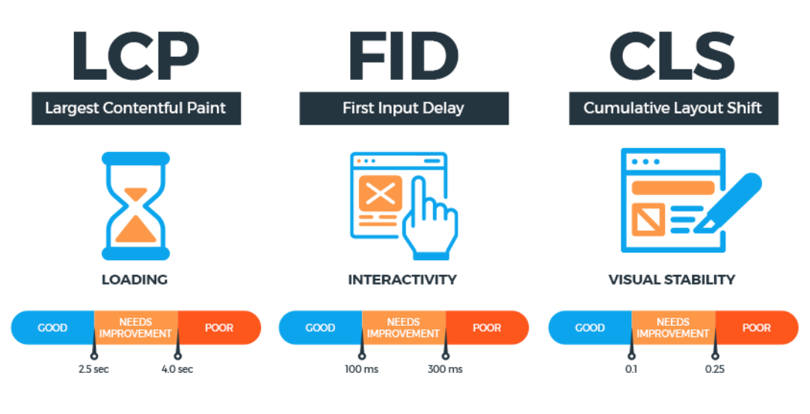

**Les Core Web Vitals sont des critères de performances simples et unifiés qui permettent de comprendre en un coup d'œil les principaux freins techniques et ergonomiques à l'utilisation de votre site web.**

::::

::::verso
__Rendre accessible à tous__
# Core Web Vitals

**Signaux essentiels en français, cette nouvelle initiative de Google vise à améliorer la vitesse de chargement et l’expérience utilisateur (UX) de tous les sites Internet. Elle repose sur trois mesures et ces indicateurs sont maintenant intégrés dans la plupart des outils d’analyse de page Web.**
**Les valeurs obtenues sont intégrées dans le classement SEO de Google depuis mai 2021.**

**LCP (mesure la performance) marque le moment exact où le plus grand élément de contenu au-dessus du pli (ce que vous voyez sans défiler vers le bas) est entièrement chargé. 

FID (mesure l'interactivité) mesure le temps entre le début du chargement et la possibilité d’interagir avec le contenu.

CLS (mesure la stabilité visuelle) surveille le décalage cumulatif de mise en page c’est-à-dire que les éléments ne se déplacent plus visuellement sur la page.

Note : le FID est mesurable à la main, mais dans les outils il souvent est remplacé par le Total Blocking Time (TBT)


::::

:::::