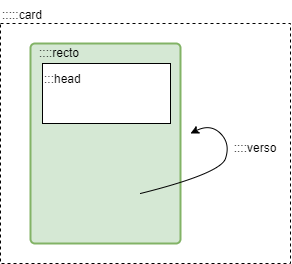

:::::card

::::recto
:::head
__Flip card__
# Configuration
> Configuration file specificity
:::

In the `config.json` file, the template name is `flip-card`.

```json
{
  "template": "flip-card",
  "templateParams": {
    "rectoCardLogo": "assets/recto.webp",
    "versoCardLogo": "assets/verso.webp",
    "cardGradientColor1": "rgba(191,30,104,1)",
    "cardGradientColor2": "rgba(238,34,56,1)",
    "cardHeadColor": "white"
  },
  [...]
}
```

## Click on the card to see the configuration details
::::

::::verso
__Flip card__
# Configuration

Params can be set :
- `rectoCardLogo` path to the recto footer image. default: none.
- `versoCardLogo` path to the verso footer image. Can be same as `rectoCardLogo`. default: none.
- `cardGradientColor1` first color of the recto head gradient square. default: red as this card.
- `cardGradientColor2` second color of the recto head gradient square. default: red as this card.
- `cardHeadColor` color of head square text, must contrast with `cardGradientColor`. default: white.
::::

:::::

:::::card

::::recto
:::head
__Flip card__
# Usage
> Markdown specific tags to use with this template
:::



`Flip card` template use some custom markdown tag as `card`, `recto`, `verso` and `head` to allow you to control how to place your content.

## Click on the card to see example

::::

::::verso
__Flip card__
# Usage

```markdown
::::: card


:::: recto

::: head
__Context sentence__
# Title of the card
> Quote sentence
::: 


The front content
[...]
:::: 


:::: verso
The back content
[...]
::: img small|medium|large

::: 
:::: 


::::: 
```

::::

:::::


:::::card

::::recto
:::head
__Flip card__
# Export cards
> PDF / Print export is available on this template
:::

`Flip card` can be exported in PDF or print. Just use print function of your browser.

&nbsp;

This will generate A5 sized card (front and back side by side). So export it as A5 support of A4 portrait.


::::

::::verso
__Flip card__
# Nothing to see here !


::::

:::::
