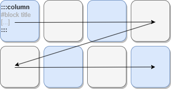
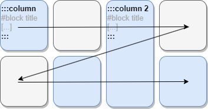
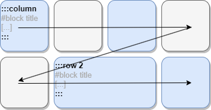
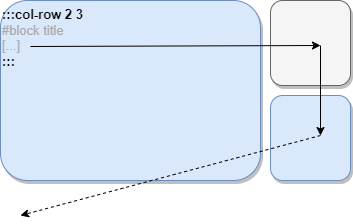
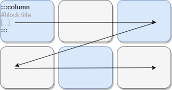

::: column
# Configuration
To configure this template, you must see our [quick start](../quick-start/cheatsheet.html)

In the `config.json` file, the template name is `grid-flow`.

```json
{
  "template": "grid-flow",
  "templateParams": {
    "colNumber": 4
  },
  [...]
}
```

Optional params can be set :
 - `colNumber` to set number of column. default: 4.

# Philosophy

`grid-flow` template is a basic grid positioning. It will place each text block from left to right for maximum of 4 columns (can be change with `colNumber` template param).

&nbsp;



# Block separation
This template consider a block must start with `::: column {colCount}` of `:::row {rowCount}` and end with `:::`


:::

::: column

## Simple usage

```markdown
::: column => start simple column instruction

# block with markdown

::: => end column instruction
```

## Column size

You can make some columns bigger than other with the `column` parameter :

```markdown
::: column 2 => start double column instruction

# block with markdown

::: => end column instruction
```




## Row size

You can make some rows bigger than other with the `row` parameter :

```markdown
::: row 2 => start row instruction
# block with 2 unit width
::: => end row instruction 
```



:::

::: column

## Column and row size

Finally, you can set both column and row size with the specific `col-row` parameter :
```markdown
::: col-row 2 3 => start block of 2 column and 3 row
# block with 2 unit width
::: => end row instruction 
```



# Change grid size

The grid has limited row but its columns number is fixed. 

As explain above, you can change the column number by changing `colNumber` in the `config.json` file.

```json
{
  "templateParams": {
    "colNumber": 3
  },
  [...]
}
```

Each column will then grow up to take spaces of then 4th column.

&nbsp;



:::

